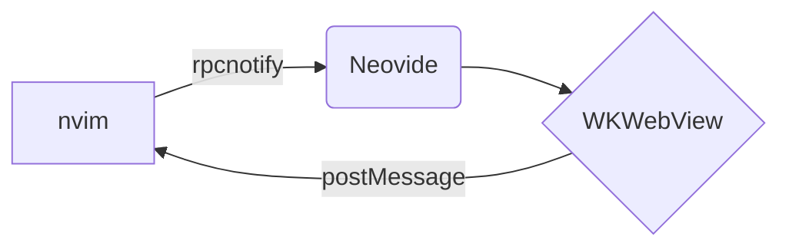
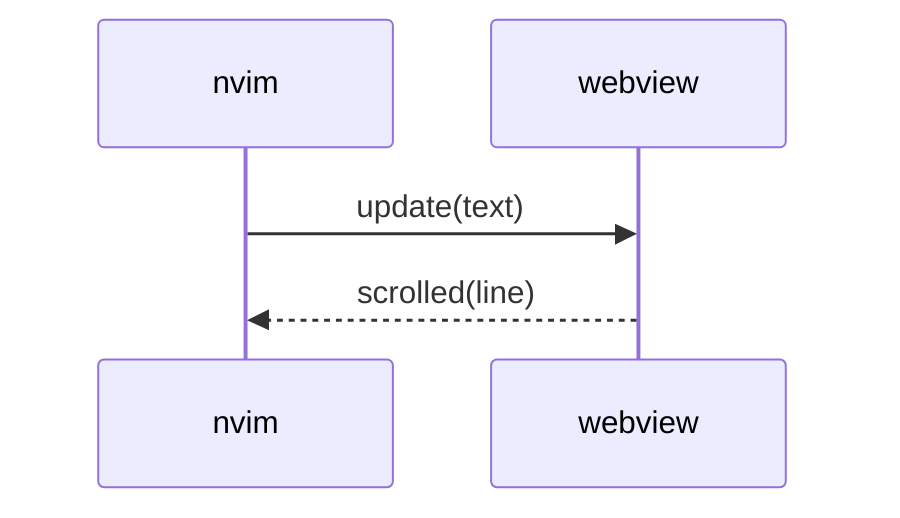

# Kitchen sink

Paragraph with **bold**, *italic*, ~~strikethrough~~, `inline code`, a [link](https://github.com),
an autolink https://neovim.io, an emoji :rocket: :+1:, and a footnote[^1].

## Headings

### Third level

#### Fourth level

##### Fifth level

###### Sixth level

## Lists

- Item one
- Item two
  - Nested item
  - Another nested
    1. Ordered inside
    2. Second
- Item three

1. First
2. Second
3. Third

### Task list

- [x] Done task
- [ ] Open task
- [ ] Another open task

## Alerts

> [!NOTE]
> Useful information that users should know.

> [!TIP]
> Helpful advice for doing things better.

> [!IMPORTANT]
> Key information users need to know.

> [!WARNING]
> Urgent info that needs immediate attention.

> [!CAUTION]
> Advises about risks or negative outcomes.

> Plain blockquote
> spanning two lines.
>
> > Nested quote.

## Code

```lua
-- Lua with highlight
local function greet(name)
  return ("hello, %s"):format(name)
end
print(greet("world"))
```

```rust
fn main() {
    let v: Vec<u32> = (1..=10).filter(|x| x % 2 == 0).collect();
    println!("{v:?}");
}
```

```diff
- removed line
+ added line
  unchanged
```

    indented code block
    second line

## Tables

| Left | Center | Right |
|:-----|:------:|------:|
| a    | b      | c     |
| long cell content | `code` | **bold** |
| 1 | 2 | 3 |

## Math

Inline math $E = mc^2$ and $\sum_{i=1}^n i = \frac{n(n+1)}{2}$.

$$
\int_0^\infty e^{-x^2}\,dx = \frac{\sqrt{\pi}}{2}
$$

```math
\begin{aligned}
\nabla \cdot \mathbf{E} &= \frac{\rho}{\varepsilon_0} \\
\nabla \times \mathbf{B} &= \mu_0 \mathbf{J}
\end{aligned}
```

## Mermaid





## Images


## HTML

<details>
<summary>Click to expand</summary>

Hidden content with **markdown** inside.

</details>

<kbd>Ctrl</kbd> + <kbd>C</kbd>, H<sub>2</sub>O, x<sup>2</sup>

<p align="center">Centered HTML paragraph</p>

## Links

- [Anchor to tables](#tables)
- [Other document](other.md)
- [Other document section](other.md#section-two)
- [External](https://github.com/neovide/neovide)

---

## Long text

Lorem ipsum dolor sit amet, consectetur adipiscing elit. Sed do eiusmod tempor incididunt ut labore et dolore magna aliqua. Ut enim ad minim veniam, quis nostrud exercitation ullamco laboris nisi ut aliquip ex ea commodo consequat.

Duis aute irure dolor in reprehenderit in voluptate velit esse cillum dolore eu fugiat nulla pariatur. Excepteur sint occaecat cupidatat non proident, sunt in culpa qui officia deserunt mollit anim id est laborum.

Curabitur pretium tincidunt lacus. Nulla gravida orci a odio. Nullam varius, turpis et commodo pharetra, est eros bibendum elit, nec luctus magna felis sollicitudin mauris.

[^1]: The footnote text.
